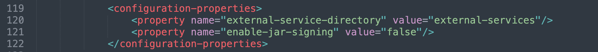
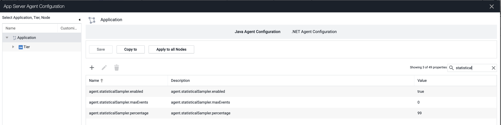

# AppDynamics Java Agent Pega Fixer Dynamic Service Extension

This extension allows the AppDynamics Java Agent to run retransformation more often and hopefully account for Pega dynamic compilation, that we are missing OOTB

This plugin is in BETA and not supported by AppDynamics, please report any issues to this github repository and our team will respond as soon as possible.

## Theory of Operation "how does it work"

The agent dynamic service needs to be installed and then node properties from the Controller UI will dictate how it acts
setting the following will cause it to perform the updates. The service will run and check for upgrades every 3 minutes, so when changing these parameters make sure to allow time to see execution.

    "agent..enabled" - boolean, setting this to true causes this service to come alive

Once enabled, it will initialize retransformation again as though rules have changed, it may do more as i work through it, but that is the first thought on writing this

## Installation - You only have to do this once

Some setup. This should be installed in the < agent install dir >/ver##.###/external-services/ directory
the < agent intall dir >/ver##.###/conf/app-agent-config.xml at line 120 has to have signing disabled in the "Dynamic Services" section:

    <configuration-properties>
        <property name="external-service-directory" value="external-services"/>
        <property name="enable-jar-signing" value="false"/>
    </configuration-properties>

## How to "do it"

Custom node properties control these activities. Setting the <B>"agent..enabled"</B> node property to true will enable this service.

## How to Monitor what it is doing

The new service will publish metrics, in [Agent|]
Also, look at the Dynamic Services Logs
